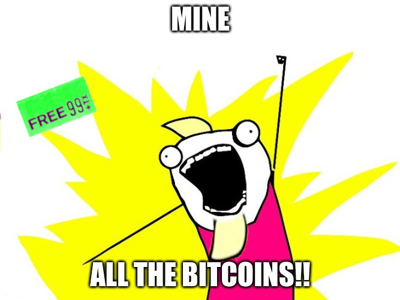

  

Often when introducing bitcoin, people ask a similar set of questions:

- How do I mine bitcoin?
- How do I mine *all* the bitcoin?
- Okay, but is there a way to do it for free?

A common answer would be to say something like:

> Well, if the last two were possible, it would kind of defeat the whole purpose of bitcoin as a trustworthy decentralized payment system with fair distribution. 
> 
> If it were controlled by a single central authority, wouldn't that kind of make it worthless?

Most people who "know" about bitcoin are dismissive, but maybe the last two are serious questions after all. Perhaps, if it's such a common and natural human desire, these questions are worth considering. 

This is a mostly complete but simplified outline of one way to mine all the bitcoin, as well as some defensive measures that could be taken against such an attack.

This attack takes just 13 steps around the actual bitcoin network and works through social perceptions & market forces. The attack is basically free, but it is a lot of work and it wouldn't be easy. It may not be sustainable from a practical or legal perspective. It's also not clear if it hasn't been tried already.

There are some loose ends in the 13th step, with some unanswered questions laid out. Maybe someone will solve it and make it a longer term solution... but there are counter measures outline as well. And perhaps the most important question is *How much money would people accept to live in a world without real decentralized bitcoin?*

Let's try to keep is fun, but also true to what might actually happen.

# How to mine all the bitcoin, at virtually no cost

## 1. You don't need a private bank. You need *private* a bank.

This plan can be extremely lucrative, but you might not always want anyone (but you) to know *where*, *how much* or *how little* money you actually have.  

Early bitcoiners always said "be your own bank", so you should do that, in a way.

It doesn't have to be anything fancy, it can be:

- A shack on a hillside.
- A safety deposit box at another bank.
- A rented server on a pacific island. 

In a few steps from now, you can have as many banks as you want and they can move around as much as you want, don't worry about that for now.

The most important thing is: it's *yours*.  As soon as you get to say how much money is in your bank, you'll start to feel like a million bucks.

Don't worry about registering anything or connecting it to a banking network, for now... you would need real money for that. In a few steps, you can basically buy a real bank.

## 2. Print dat Money

Fiat currency is usually paper or electronic money that is issued by governments based on need and policy. For example, at the time of writing, the preferred currency for trade is the Euro, while the preferred currency for debt is the United States Dollar. (Twenty countries also have their own dollar, which have interesting conventions in local speech.) 

Printing your own dollar tokens is fun and easy! You can just create a token on any number of blockchains. Call it anything and give it whatever ticker you want.

To have your dollar minting organization trusted, you will need to look like a real business. So it's time for another vacation!—and pro-tip: always setup ventures in a new jurisdiction, this one simple trick can buy you years of freedom (thanks! Bernie). You should be legit enough to appear as if you follow all the rules. 

But the rules for *you* are actually quite simple, repeat after me:

- "Our accounts are very complex."
- "An audit is forthcoming."
- "We've addressed those concerns already."

You can now print as many dollars as you want! 

Be careful, it's important to take it slow at first, until your dollars gain acceptance. Acceptance is *key* to the whole thing!

If the last step left you feeling like a millionaire, this step should get you feelin' like the Chairman of the Federal Reserve.

## 3. Guaranteed listing

>  The most important thing is to accept yourself.

So next, you need to get a willing cryptocurrency exchange—so you're gonna basically buy one. Why? because it's the cheapest and most friction-free way to get your dollar tokens listed.  You can often find a failing exchange or one in some sort of trouble for cheap. There's lots to choose from.

Security and reliability are **NOT really** paramount, so you can be very cheap on some things, it will get solved in the next step. It's probably best in this case if they are not "top people".

Congratulations!, not only did you get your dollars listed on an exchange, but you just bought and sold 'em for a dollar, that's it! You *are* the market. 

Now, everyone wants to know how *your* day was!

## 4. Pump up the VOLUME

Wash trading is the practice of trading something back and forth (quite a bit sometimes) to appear as if many people are trading on a healthy market. It's illegal in some markets, but is *WIDELY ACCEPTED* on nearly all unregulated crypto exchanges. 

So you get a bot to trade your dollars for another currency like bitcoin and suddenly things are happening. Someone (the bot) just bought your dollars with bitcoin, which means someone else (bot, again!) bought bitcoin with your dollars, amazing!

Next thing you know, your dollars have the highest volume of trade of anything anywhere.

If your wash trading bot fails and stops, it will be obvious to everyone what you're doing... but honestly some won't understand or care about the implications—they'll still think you're popular.

At some point, your exchange can just stop paying out real dollars to your customer's bank accounts and just use your dollar tokens.

Again, some people may not understand or like this, but they won't do anything about it. Or maybe they won't do anything until they get *their* money, or what's left of it, back. Some people might be really upset by this last one and never trust you again.

Whatever! You didn't take over a cryptocurrency exchange to make friends, just influence people.

## 5. Make new friends

There was something we skipped in the last step called "regulation", obviously that's just gonna slow everything down. And the hard truth is: operating a *regulated* cryptocurrency exchange is very difficult, and a lot of places can't do it. But for you, these unregulated exchanges is going to be *your* frens.

You need to make sure your dollar token is traded everywhere.  And that *your* token has the highest volume of any dollar token. 

If anyone gives you an issue, pay them once or monthly or as a percentage of trade volume—you kind of have infinite money after all!

## 6. We buyin' our own chains

Bitcoin blockchains are maintained by software following a common protocol, when that software disagrees, a chain fork happens, and the two coins, each on separate chains, go their merry ways.  There are about a half dozen teams that maintain software that runs some kind of active bitcoin-based chain where the first block is shared with the original bitcoin from 2009. You need to get or build (i.e. buy) one of those teams, but be careful!

Here's which one to pick:

- The software to run "a full node" should be maintained and controlled by a single company
- They need to be willing to clear out anyone who opposes your agenda 
- They *should* be lookin' to actually make their money on a spinoff business 

It's best to keep that company at arms length, but you don't always have to buy something to own it and developers are expensive anyhow. While you're at it, give some grants for some top-notch research and development, but do so "anonymously".

## 7. The cost of doin' business

Up until this point, you're operating with very minimal protection and overhead, but making lots of money. That's about to change. 

If you're serious about mining all the bitcoin (almost), you're going to need to an army of bots and shills on social media and keep them paid (you know how).

Some nation state privileges have drawbacks and paying an army is simply one of them. Sorry.

Find an army of trolls that can provide you round-the-clock coverage when you need it, like for the next step.

## 8. Woohoo! Purge.

If you need to purge 90% of the people in the online community around your bitcoin, **DO IT**. It needs to happen, and the sooner the better. Ban them forever.

Some of them will leave the space, some of them might actually come back. You can also be really childish and nasty so they don't come back, it will help you in the long run.

After that, only a small fraction of new comers who don't get *you* will need to get banned on an ongoing basis.

Some will go off and do their own thang. You'll deal with them all in their own special way when *you* mine all the bitcoin... in 3.. 2.. 1.

## 9. Mine all the bitcoin

Mining is a noisy capital-intensive and (usually) industrial business nowadays. Cleaner than a coal, but not somewhere you want to be near. It's loud.

Instead, just show the peasants the power of your fully operational ExaHash system. 

That's right the previous 8 steps gave you:

- The best banker in the world—yeah you're fully backed.
- You can mint inflows of capital to markets as token dollars.
- You can single-handily dictate volume.
- You can dictate coin price.
- That software company you found will market your coin as a premium product, nice!
- Your full-node company allies will always look more professional than a rag-tag open-source group.
- Best part is, because of all that, you can make users pay a serious kickback fee to miners of your chain. 

This alone can get your chain up to about 80% of the hash rate without needing to wait for a mining rig.

**If** there is a viable blockchain that continues to be mined by a splintered part of the community, you should have some market manipulation chops from the exchange. It's sell walls, short ladders, and shorting interest all the way down. There are also attacks specific to blockchain. Specifically, there is something wonderful called *hostile forks without replay protection* which are great to show the community and users of your competition how right you were, though their users really might not like that. Say goodbye to them for now! 

The high price for your coin, with a low price on other coins reaffirms to everyone what you promised and the competence of your full-node team.

You're always so right!

Now before you throw up your address to receive all the bitcoin, if you know that the software, mining, market and bulk of inflowing capital can be controlled by one party (you), then you know the price is just whatever you manipulate it to be. So now you know the one simple trick to start making the real money.

## 10. The pump is yours as you see fit

At this point in your mining adventures, you probably should start raking it in. And all your new friends and remaining community can pile in for a good ol' pump and dump scheme. 

Run your community purges years in advance of your pumps to allow new people to come in a get a proper education.

Make sure there's always lots of your dollars floating around. You can pump as much money into any unregulated exchange as you want.  Honestly, since the tokens you print are on chain, often times it's likely you won't have to do anything but mint them to make the price go up.

For the dump, there may need to be some real dollar outflows from your real bank accounts, but the majority of the dollars you owe will stay "with you" because access to traditional banking isn't an option for the shady exchanges you sent tokens to anyway.

Don't pump and dump too often, or people will see some correlations. Actually, as long as you don't do anything crazy, any party acting as an exchange/brokerage/backing-institution offering clients leverage should have plenty of funds from liquidating greedy traders at will.

But it doesn't really matter if people call you out, or start openly hailing the dollar tokens as a wonderful ponzi scheme, because they all want to be token-rich together.

And most people will not understand who *you all* are or what you are doing.

## 11. Multiple successful CEOs volunteer to work for you

There are some limitations to the reach of your powers.

Specifically, in the country where the dollar you peg is issued:

- You **can't** even open a bank account there without it getting seized.
- You **cannot** stop that government from investigating you, forever.
- You **won't** really get your dollar token listed on a regulated exchange, well maybe just one so it can be shorted, sorry.

Which could be difficult if you're suppose to be holding a lot of money from that country in your many different offshore accounts.

Also, 
- You obviously **can't** pitch anything to anyone who does due diligence. 
  

However, if you get your social bots setup right:

- You **can** get prominent CEOs to openly support your premium branded bitcoin chain.
- You **can** get them to integrate your chain *exclusively* in their new financial services.
- You **can** get those public companies to market those financial services in apps for young people and people with less access to financial services. 

You might not even have to ask them. A few of them have to know the game and are piling in with their personal money too.

Surely nothing will happen to them but a (very) small fine anyhow. 

## 12. Get start-ups to have "used" it

Let's say a start-up plans to use *your* premium bitcoin product along with some other cryptocurrencies for an app involving scripted payments.  

Well, their users probably won't be happy with the high fees, especially for escrow Bitcoin Script contracts which are longer than simple transactions. And although most people will only want to use the premium chain, the transaction might not reliably go through, or perhaps it could result in some bad user experiences, or even a loss of funds. So most people just end up avoiding the app entirely.

*What will a startup do when the app never takes off?*

You guessed it, try to raise more venture capital, of course! They might do a Series A lead by the **Ontario Municipal Employees Retirement System** to eventually integrate more "features" created by your premium chain (that everyone likes, but has issues with).

*How will the pensioners get paid?*

Who cares! They should have invested directly in the token ponzi like the CEO of that failed app company. Or the CEO of the app where people without bank accounts can buy *your* bitcoin. Wow, pensioners still don't know anything about your bitcoin.

## 13 [WIP]. So goes the Market! ...

So Congratulations! By now you could be controlling all bitcoin mining (~99%ish).  As well as most of the public discourse and thought around what *bitcoin* means period—like truly epic gas-lighting.

A lot of finance is clueless.  A lot of people are staking their professional reputation and a significant portion of their fortunes on ya'll being stand-up dude(s)—some are very wealthy or powerful people, smart investors who were given ampule evidence to raise suspicions, but they think you're five separate things. And most don't understand open source software or cryptocurrency at all.

However, some in the cryptocurrency community not only support your behavior, but try to actively profit from it. Even when people say the dollar tokens are fake and the premium bitcoin fees are too high, a lot will come to defend you *aren't* paid whatsoever, and they're defending you because they watched you'all long enough to know both of those things to be true! And they also see a lot of money to be made by scamming new "users".

Even though most people are on your side, it's good to crack the whip a little. So you should always strive to convince everyone that there will be no more parties and no more fun if one entity can't control *all* bitcoin mining. 

These are the talking points (substitute the tickers you created in steps 2 & 6):

- If [ dollar token ] fails, [ premium bitcoin chain ] goes down.
- If [ premium bitcoin chain ]  goes down, everything else will go down too.
- That's what *always* happens.

As well as the old standards: 

- All other working bitcoin chains are scams.
- **Everyone** supporting a bitcoin fork is a scammer, a bag holder, a shill, 
- Our chain is not a fork, but all the other ones are.
- [ name of version of bitcoind that your company maintains ] is the most decentralized version of bitcoin.
- [ premium bitcoin chain ] and [ the dollar token ] have nothing to do with each other.

This should be able hold your one entity control on bitcoin for quite some time and allow you to do *whatever* you want.

Have fun controlling the mining of all the bitcoin for no real cost! You made it!

## Outstanding Issues

The **problem** in the last step, is a **people** problem, but not one money can solve. Or, specifically, not one that can be solved with the money *you* print.

Some pertinent issues may include:

How can you control **everyone, all the time**?

How can you deal with people who (for whatever reason) don't want to knowingly participate in an open ponzi? Call them scammers?

How could you control what a new government administration decides to do?, because they sure do have their own money and they *tryna keep it reaal*.

How do you keep people trying to use something that is extremely expensive, difficult to use and unreliable?

For the dollar token side, if private companies and blockchains already have a sum of all the issued tokens, how long would people actually wait for an audit of the real dollar side before they accepted it as a scam? If you can't be audited at $500M, how would an audit at $30B look? 

How many people will forever believe you could honor a peg for dollars in a country you can't legally control a single dollar real or tokenized?

How long would it take for enough people to figure out that your *sure thing* with you controlling all mining, making the market, and printing reserves doesn't work when **enough** people understand it?

When the IMF, the *New Republic* and crypto twitter all start saying the same thing, when does it sound like not **everyone** thinks that it is going to be a safe ride?

How long would it take for **enough** people to say, "You know what, these dollar tokens, the shady exchanges, the fake volume, and this chain are all radio-active. I'm out." 

# Possible counter-measures to a fiat token ponzi attack

## The "No & None" defense

Jeffery Epstein often loved to rock a Harvard sweatshirt, presumably because pretending he went to a privileged university played better than some obscure utilitarian artifact. The sweatshirt opened a lot of doors and made people trust him.  Epstein understood the power of seeming prestigious to others (as a predator) and many people in his personal network fell into one of three categories: fellow predators, accomplices and victims. 

Now, predators are the people who paid to exploit victims, but they didn't necessarily pay the victims and they didn't always pay with money. 

It was always a bit grayer with accomplices and/or victims, which was critical to how the network grew and functioned.  He would often offer his personal victims money in exchange for what he wanted, which they could refuse. If they refused, he would offer to pay them the same money to be an accomplice and recruit their friends instead.  He would offer the money for each friend, which is also an offer he would make to his victims after abusing them.

Now if Jeffery Epstein offered a prestigious institute a large donation, (with the benefit of hindsight) the appropriate questions should have been: *Are we the victim or the accomplice?* or *Why did someone give this money to a child sex predator?* and *What kind of person is asking him to give it to us?* 

It could have been that Epstein was just picking up a metaphorical box of sweatshirts for some of his peers. But if that money funded blockchain research and lead full-node developers, it might be pertinent for the users of that software chain and network to ask *Am I an accomplice or a victim of predators trying to exploit people?*

If you don't personally want to be a victim of this type of exploitation, the defense is to be aware of it in the first place, and to say when appropriate:

- "**No**, I don't want your money; I know what you are, your money is no good."

Just for completeness, the defence to the counter-offer is: 

- "No, **none** of my friends do either."

Regardless of what one person chooses, exploitation continues because it's usually possible to simply find new vulnerable people to exploit with the promise of money. It's *not* the victim's fault for not saying no, it's society's fault for knowing about it and turning a blind eye to the exploits of *faux*-wealth and *faux*-prestige. 

"Looking out for number one" in this case means not allowing the promise of money and a good time (or a gift shop sweatshirt) to trick you into trusting someone who just wants to fuck you and all your friends. Say no, and if you can, warn those around you, or call it out.

## Exercise the Ponzi

It's fairly safe to say that at least good ol' Bernie Madoff had nothing to do with any particular bitcoin forks, except to exacerbate the economic crisis the original `bitcoind` was written during. 

Though the SEC had been warned, and Bernie was blacklisted on Wall St., no one ever did a thing to protect his investors—except his investors.  

The Madoff ponzi failed because concerned investors withdrew funds and caused a liquidity failure, that is, Bernie could no longer pay out old investors with the funds of new investors, as so many investors withdrew so quickly.  

If the authorities had shut Bernie down months earlier, it would have saved some of the very last investors but, overall, the amount of money paid out would have been the same. While the authorities may have paid out all victims pennies on the dollar proportional to their actual investment, the authorities were unlikely to have ever shut it down in the first place.

What actually happened is that investors acted when they became suspicious of fraud and were rewarded their full promised return. And they also protected future investors, which regulators were unwilling or unable to do—despite the fraud being obvious to most seasoned investors with five minutes of free time.

There are investors who will never invest in an obvious ponzi, and those to whom a ponzi will never be obvious. Those groups have no role in this counterattack because they never sell, or sold long ago.

There is a third type of investor, the rational or greedy investor, who (knowing that it's a high-risk ponzi with a very high rate of return) invests money hoping to take the full return before the scheme is no longer liquid.  The third investor **deliberately bought (or holds) shares of a ponzi** and hopes to take profits **before they expire worthless**.

The longer a greedy investor waits, the greater the return, but also greater the risk of a near total loss, caused by counterparts acting beforehand. The greedy investor is not fooled by confirmation bias enforced by rosy markets. 

In the unbacked dollar-token inflow mining attack outlined in steps 1-13, the price of a bitcoin chain consistently pushed upward by unbacked tokens could cause the total chain value to be an order of magnitude greater than the Madoff ponzi, even when the dollar token value seems to be less than one Madoff.  If an alternate chain has survived that is conversely manipulated downward, the multiplier for greedy investors looking to eventually mitigate risk from the ponzi becomes extreme and comes to some peak as the ponzi progresses.  

Leading up to the end of the Madoff ponzi, there had been many warnings in the broader economy. Greedy investors riding the ponzi who listened to the warnings got out and did so handsomely. Greedy investors who waited for a definitive signal lost their full investment.

With all bitcoin chains on the original emission schedule having fixed total supply, all investors would have a choice between some small fraction of total equity in a giant ponzi or a much greater share of total equity in a (possibly) better project, that doesn't have an indeterminate expiration date. The longer they wait the more risky this play becomes, because the very same reward to act awaits any greedy rational investors who act before them.

Likewise, as the multiplier for acting increases, so does the rate at which a ponzi bleeds out. The faster it bleeds, the more obvious the outcome. The more sharks in the frenzy, the faster they turn a leviathan into a murky plume.

Anyway, that's the end of the exposition. 

If anyone still wants to mine all the bitcoin for free, it should be clear how, but maybe less clear how to do it forever. We also covered how to defend you and your friends from the attack. And the type of counterattack thats likely to end it.

